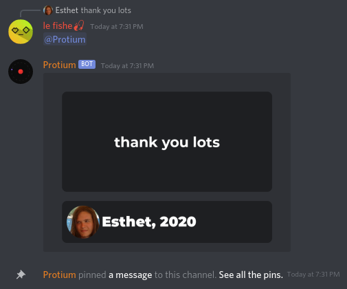

# protium
it generates quotes and pins them, I guess\

# invite it
[use this link](https://discord.com/oauth2/authorize?client_id=790298391338287134&scope=bot)

# license
it's MPL-2.0 (see [LICENSE.md](LICENSE.md))

# acknowledgements
this project uses the Montserrat font which is distributed under the SIL OFL (see `SIL Open Font License.txt`)